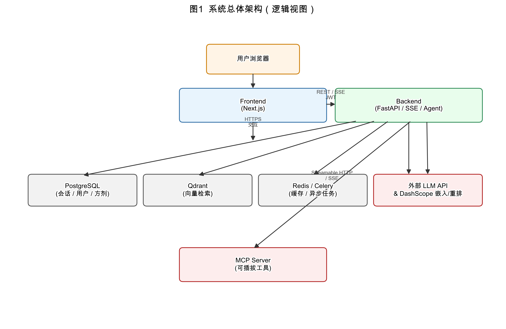

# 中医智能问询系统 — 项目技术方案设计

> 依据软件工程研究中的需求工程、架构权衡分析与实验验证等方法[7][8]，结合国家标准对开源治理与软件成分安全的要求[2][3]，以及成熟开源生态与敏捷迭代实践，对本项目进行技术方案设计与说明。本文参考文献著录格式参考 GB/T 7714—2015[1]。

---

## 1. 方法、技术与工具（工程化视角）

| 维度 | 采用的方法 / 工具 | 在本项目中的用途 |
|------|-------------------|------------------|
| 需求与问题界定 | 用户故事、痛点清单、非功能需求（NFR）矩阵 | 区分「对话体验」「知识可信」「合规边界」「运维成本」等优先级 |
| 体系结构设计 | C4 思维（上下文 / 容器 / 组件）、关注点分离[7] | 前后端分离、领域模块划分（对话、知识库、方剂、MCP、认证） |
| 风险与依赖治理 | SBOM 意识、许可证合规、可替换适配层[2][3] | 多厂商 LLM 统一工厂、向量库与嵌入抽象，降低供应商锁定 |
| 质量保障 | 自动化测试（pytest）、集成测试、契约文档 | `backend/tests/`、`doc/frontend-integration.md` 等与接口演进同步 |
| 交付节奏 | Scrum 式短迭代、可持续集成的小步提交[8] | 每迭代交付可用增量（API、页面、Agent 工具） |
| 基础设施即代码 | Docker Compose、环境模板 `.env.example` | 一键拉起 PostgreSQL / Redis / Qdrant，降低协作门槛 |

---

## 2. 需求分析与痛点

**业务与用户需求（摘要）**

- 面向中医主题的**自然语言问询**，支持流式输出，响应要快、可中断、可追问。
- 需要结合**机构或个人知识库**（条文、讲义、内部规范等），回答有据可查，减少“凭空编造”。
- **方剂与结构化病症线索**需要可检索、可解释，与“纯向量闲聊”区分开。
- 在合规上明确**非诊疗声明**：产品定位为信息辅助与科普导向，符合生成式人工智能服务相关合规要求[6]，不能替代执业医师诊断处方。

**主要痛点**

1. **幻觉与可信度**：通用大模型缺乏领域材料时易泛泛而谈；采用**检索增强生成（RAG）**及工具化检索抑制胡编[4][5]。  
2. **知识与业务的两种形态**：非结构化文档（PDF/DOCX）与结构化方剂数据并存，一套模型难以兼顾，需**分治架构**（向量域与关系库域解耦）。  
3. **集成扩展**：机构内常有自研工具、搜索、数据库；固定死工具集无法演进，引入 **MCP（Model Context Protocol）** 实现可插拔工具集成[9]。  
4. **成本与延迟**：长文档入库、嵌入、重排消耗算力与时间；大文件需**异步任务**（Celery 或后台任务）避免阻塞在线请求。  
5. **多模型与可运维**：不同环境 API Key、模型名不同；通过 **工厂模式** 抽象多厂商对话模型接口，降低替换成本（与模块化及稳定接口边界的体系结构实践一致[7]）。

---

## 3. 软件体系结构与技术方案

### 3.1 总体架构（逻辑视图）

采用 **前后端分离 + BFF 式后端 API**[10][11]：

- **前端容器**：Web 应用（Next.js），负责会话界面、设置页（知识库、Agent、MCP）、认证态与流式消费展示。
- **后端容器**：FastAPI 应用，汇聚 HTTP/SSE、业务规则、Agent 编排、持久化与任务派发。
- **数据与中间件**：PostgreSQL（会话、用户、方剂与业务表）、Redis（缓存/消息）、Qdrant（向量检索）。
- **异步工作者**：可选 Celery Worker 执行重负载入库；也可降级为进程内 `BackgroundTasks`。

**图1** 给出与上述叙述一致的逻辑架构。图源采用绘图脚本生成 **SVG/PDF 矢量图**（满足学术与技术文档制图规范），路径见 `doc/assets/architecture-system.svg`；亦可使用同目录 **PNG**（300 dpi）插入 Word。

### 3.2 核心组件与职责

| 组件 | 职责 | 开源基础 |
|------|------|----------|
| **对话与流式** | SSE、会话与消息持久化、策略提示（合规文案） | FastAPI、Uvicorn |
| **Agent 层** | ReAct 编排、工具注册与调用 | LangGraph、LangChain |
| **RAG 管道** | 文档解析、分块、嵌入、向量召回、可选重排序[4][5] | pypdf、python-docx、Qdrant 客户端 |
| **方剂子域** | 结构化存储、关键词 + 相似度 + 全文检索融合 | PostgreSQL、`pg_trgm` 等扩展 |
| **MCP 集成** | 服务注册、健康探测、工具桥接到 LangChain | `mcp` 官方 Python 包[9] |
| **认证** | 注册登录、JWT；可扩展 OAuth | 生态惯例实现 |

### 3.3 关键技术决策（权衡摘要）

1. **LangGraph ReAct + 显式工具**：在可解释性与扩展性之间取得平衡；工具即「能力边界」，便于审计与教学演示。  
2. **向量库选 Qdrant**：成熟、易 Docker 化，社区活跃；与业务库 PostgreSQL 各司其职。  
3. **多厂商 LLM 经 `chat_factory` 统一出口**：对接 OpenAI 兼容与各厂商 SDK，便于对比实验与灾备切换。  
4. **异步入库可选**：默认开发环境可关 Celery；生产或大文件场景开 Worker，符合**渐进式复杂度**。

---

## 4. 开源软件思想与成熟项目运用

- **站在巨人肩上**：不重复造「HTTP 框架、向量引擎、Agent 编排、文档解析」等通用层，以 **Apache-2.0 / MIT** 等宽松许可的主流项目为基座；许可证治理可参考国家标准中的开源许可证框架思路[2]。  
- **开放互操作**：通过 **MCP** 将“工具”从单体代码中解耦[9]，符合“可替换、可组合”的互操作理念。  
- **可审计与合规**：在 README 与依赖清单中可追溯主要第三方组件；开源成分安全评价方法强调来源、质量与知识产权等要素[3]。敏感配置经环境变量注入，仓库内仅保留 `.env.example`。  
- **许可证策略**：核心依赖以 OSI 认可的主流许可为主；若课程或机构要求本土化表述，可单独评估 **Mulan PSL v2** 等对**项目仓库声明层**的适用性（与依赖栈许可区分）。

---

## 5. 敏捷开发模式落地

| 实践 | 说明 |
|------|------|
| **Product Backlog** | 条目按价值排序：例如「流式可用 > RAG 入库 > 方剂工具 > MCP 面板」。 |
| **Sprint / 迭代** | 建议 1～2 周；每迭代结束有可演示的增量与更新的 `doc/` 契约。 |
| **Definition of Done** | 功能可用、核心路径有测试或手工用例记录、环境变量与 Compose 不破坏开箱体验。 |
| **持续集成** | 提交即跑 `pytest`；前后端变更同步更新集成文档。 |
| **回顾改进** | 每迭代回顾「幻觉案例、检索失败、延迟瓶颈」，反哺分块策略、重排开关与提示词。 |

**与研究的衔接**：可将每一迭代假设（例如“加重排是否显著降低无关片段”）记录为小型实验，用固定问集做前后对比，形成可复现结论——体现软件工程研究中的**度量驱动改进**（与经验主义软件工程中的迭代—度量闭环一致[8]）。

---

## 6. 非功能需求与演进方向

- **性能**：流式首包时间、Qdrant 召回延迟、重排开关的 trade-off。  
- **安全**：JWT 与 HTTPS、服务端校验、MCP 外连的白名单与超时策略。  
- **可用性**：Docker Compose 一键环境；配置热切换减少重启次数。  
- **演进**：更多领域工具（饮片、经络穴名规范化）、评测集与自动回归；多租户与审计日志可按机构需求迭代。

---

## 7. 结论

本方案以**需求与痛点驱动**，用**分层与分域**的体系结构[7]承载对话、RAG[4][5]、结构化方剂和 MCP 扩展[9]；以**成熟开源栈**降低实现风险，以**敏捷迭代与自动化验证**保证交付可持续[8]。该设计兼顾课程/课题的**可演示性**与实际工程中的**可运维、可替换、可合规**要求[2][3][6]，可作为项目实施与论文/报告的技术路线章节基础。

---

## 8. 参考文献

[1] 国家标准化管理委员会. GB/T 7714—2015 信息与文献 参考文献著录规则[S]. 北京: 中国标准出版社, 2015.  
[2] 全国信息技术标准化技术委员会. GB/T 44272—2024 信息技术 开源 开源许可证框架[S]. 北京: 中国标准出版社, 2024.  
[3] 国家市场监督管理总局, 国家标准化管理委员会. GB/T 43848—2024 网络安全技术 软件产品开源代码安全评价方法[S]. 北京: 中国标准出版社, 2024.  
[4] LEWIS P, PEREZ E, PIKTUS A, et al. Retrieval-augmented generation for knowledge-intensive NLP tasks[C]// Proceedings of the 34th International Conference on Neural Information Processing Systems. Curran Associates Inc., 2020: 9459-9474.  
[5] GAO Y, XIONG Y, GAO X, et al. Retrieval-augmented generation for large language models: a survey[J/OL]. arXiv, 2023, 2312.10997. https://doi.org/10.48550/arXiv.2312.10997.  
[6] 国家互联网信息办公室, 国家发展和改革委员会, 教育部, 科学技术部, 工业和信息化部, 公安部, 国家广播电视总局. 生成式人工智能服务管理暂行办法[Z]. 2023. （国家互联网信息办公室等七部门联合公布，2023-07-13 公布，2023-08-15 施行.）  
[7] BASS L, CLEMENTS P, KAZMAN R. Software architecture in practice[M]. 3rd ed. Upper Saddle River: Addison-Wesley, 2012.  
[8] SCHWABER K, SUTHERLAND J. The Scrum Guide[EB/OL]. Scrum.org, 2020. https://scrumguides.org/scrum-guide.html.  
[9] Anthropic, PBC. Model Context Protocol (MCP)[EB/OL]. 2024. https://modelcontextprotocol.io/.  
[10] RAMÍREZ S. FastAPI: modern, high-performance web framework for building APIs[EB/OL]. 2024. https://fastapi.tiangolo.com/.  
[11] Vercel Inc. Next.js documentation[EB/OL]. 2024. https://nextjs.org/docs.  
[12] 国家中医药管理局. “十四五”中医药信息化发展规划[Z]. 2022.

---

## 9. 文档版本管理与变更日志

**版本策略**：主版本号 **.** 次版本号 **.** 修订号（语义化思想）；与本技术方案正文紧密相关的表结构、对外 API、架构容器边界变更记为**次版本**递增；错字与引用勘误记为**修订号**递增。

| 版本 | 日期 | 变更类型 | 变更摘要 | 影响范围 |
|------|------|----------|----------|----------|
| 1.0.0 | 2026-05-01 | 创建 | 初稿：方法表、需求痛点、ASCII 示意架构、敏捷与非功能需求、结论 | 全文 |
| 1.1.0 | 2026-05-13 | 重大修订 | 以矢量图（图1）替代字符画；增补≥10 条参考文献并在正文标注引用；新增版本管理与变更日志 | §3.1、§8、§9 |

**同步要求**：当 `README.md` 中技术栈或 `doc/frontend-integration.md` 契约发生重大变更时，应在同一迭代内更新本文件对应小节，并在上表追加一行变更记录。

**导出 Word**：执行 `python3 doc/export_technical_design_docx.py`；若图文件缺失，请先运行 `python3 doc/assets/generate_architecture_figure.py`。

**当前文档版本**：1.1.0
